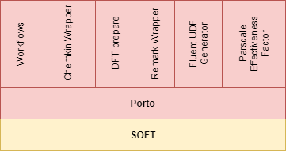

# Preface

This User Manual is a part of the NanoSim delivery and is intended to
be read by students and researchers developing software with/or based
on Porto. As Porto is build on the SOFT5 framework it is essential to
also become familiar with SOFT5. This manual will therefore cover some
introduction to the ideas and concepts in SOFT5.

SOFT5 is a toolkit for building scientific software. SOFT5 allows for
data to be formally described at a very low level. These descriptions
are used to instruct computers how data should be interpreted or
transformed. By sharing these formal descriptions, SOFT5 allows for
the coupling of software by allowing one application to read data
written by another, without having to care about how the data
represenation such as file formats etc.

Many ideas of SOFT5 aligns with the concepts of Linked Open Data and
the semantic web, however SOFT5 sacrifises the richness and dynamic
flexibility of the Resource Description Framework (RDF) with a
pragmatic and minimalistic approach that is suitable for representing
data and "state" in scientific software, and how this relates to
persistant storage (i.e. physical data storage on a harddisk in a given file format).

Porto extends SOFT5 to target different use cases in scope of the
NanoSim project. The different software packages developed as part of
the NanoSim project needs the ability to both publish (make available)
its own data, as well as using results from other
simulations.

## Scope of this manual

This manual is intended for getting started with using Porto for
connecting software platforms. As a fundament for developing with
Porto, chapter two gives a brief introduction to the fundaments of
SOFT5. In Chapter 3 Porto and NanoSim is presented. The last 2
chapters are dedicated to use cases in NanoSim where SOFT/Porto is
used to handle interoperability between different simulation tools.
