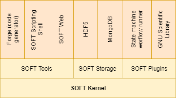

# Porto/SOFT5

SOFT is an acronym for SINTEF Open Framework and Tools. SOFT5 is a set
of libraries and tools to support scientific software development.

The development of SOFT5 was motivated by many years of experience
with developing scientific software, where it was observed that a lot
of efforts went into developing parts that had little to do with the
domain. A significant part of the development process was spent on
different software engineering tasks, such as code design, the
handling of I/O, correct memory handling of the program state and
writing import and export filters in order to use data from different
sources. In addition comes the code maintenance with support of legacy
formats and the introduction of new features and changes to internal
data state in the scientific software. With SOFT5 it is possible to
utilize reusable software components that handle all this, or develop
new reusable software components that can be used by others in the
same framework.

SOFT5 contains a core library with plugin support. The library also
comes with set of interfaces (API) to create extensions and custom
plugins. The core library is used to connect a software application
with the framework.

There are currently two supported storage options for storing with
SOFT5, namely HDF5 and MongoDB. Local data stored in HDF5 files is suitable
for managing local data

The main approach to developing software with SOFT5 is to
incrementally describe the domain of the software using entities (see
below). The entities can represent different elements of the software,
and be used in handling I/O as well as in code generation and
documentation. Entities can also be used for annotating data and data
sets. This might be useful in cases where for instance the origin of
the data, license and ownership are of importance.

Since any complex software will have many entities and often multiple
instances of the same entity, SOFT5 allows for creating collections of
entities with defined relationships. These entity collections are
called 'collections' (see below).

One idea of SOFT5 is that software may be written is such way that
business logic is handled by the codebase, while I/O, file-formats,
version handling, data import/export and interoperability can be
handled by reusable components in the SOFT5-framework, thus reducing
risk and development time.

The main components of SOFT5 is shown in Figure \ref{softarch}. The
key modules are the tools, storage support and plugin framework. The
key tools are the scripting utility and the code generator. The main
Storage module used by Porto is MongoDB. Different plugins that
extends the scripting shell includes a state machine based workflow
runner.

# Installation

This chapter describes how to install the SOFT5/Porto system. The
software is available on github: https://github.com/nanosim/porto. The
software is currently only distributed as source code, and requires
some preparation, compilation and installation steps. Here we will
show the necessary steps for installing the software on Ubuntu 16.04
LTS.

## Preparation
The software is available as a Git repository, and a local
installation of git is required. Either become root to perform the
following operations, or use the sudo command (assumes the current
user have sudo access)

	$ sudo apt-get update
	$ sudo apt-get install -y git
	
Download the source code to an appropriate folder using git.
	
	$ git clone git@github.com:NanoSim/Porto.git soft5
	
Before the code can be compiled, a set of dependencies needs to be
installed. First of all the development tools (compilers++) is
needed. We will also need CMake, HDF5 (development), GTest
(development), boost (development)

	$ git install -y build-essential cmake libhdf5-dev cmake libgtest-dev libboost-all-dev
	
Before we can use GTest, it needs to be build as a shared library

	$ cd /usr/src/gtest
	$ sudo cmake -DEBUILD_SHARED_LIBS=On . && sudo make
	$ ln *.so /usr/lib
	
In order to use MongoDB, we need to add the official repository.

	$ sudo apt-key adv --keyserver hkp://keyserver.ubuntu.com:80 \
	  --recv 0C49F3730359A14518585931BC711F9BA15703C6
	$ echo "deb [ arch=amd64,arm64 ] http://repo.mongodb.org/apt/ubuntu xenial/mongodb-org/3.4 \
	  multiverse" | sudo tee /etc/apt/sources.list.d/mongodb-org-3.4.list
	$ sudo apt-get update
	$ sudo apt-get install -y mongodb-org libmongoc-1.0.0

SOFT5 is built on Qt5. Qt5 comes with its own online installer which
can be downloaded and run for the official website. Here we use Qt 5.7 (any Qt 5.x should be ok)

	$ wget http://download.qt.io/official_releases/qt/5.7/5.7.0/qt-opensource-linux-x64-5.7.0.run
	$ chmod +x qt-opensource-linux-x64-5.7.0.run
	$ ./qt-opensource-linux-x64-5.7.0.run
	

Now that all external dependencies have been resolved, we will also
need to set up our local command prompt environment. If you are using
bash, add the following to your .bashrc

	$ export QTDIR=<path-to-installed-Qt>/5.7/<platform>
	$ export PATH=$QTDIR/bin:$PATH
	$ export LD_LIBRARY_PATH=$QTDIR/lib:$LD_LIBRARY_PATH

here <platform> will typically be gcc_64 on GNU/Linux.

## Configuration, compilation and installation
The next step is to configure and install SOFT5.

	$ mkdir build-soft5
	$ cd build-soft5
	$ cmake -DCMAKE_INSTALL_PREFIX=/usr/local/soft5 -DWITH_PORTO=yes ../soft5
	
Note that your local installation may need help to find different
software components. It is therefore recommended to use ccmake (CMake
with curses interface) when configuring the build process.
	
	$ make 
	$ make test
	$ sudo make install
	

# SOFT5 Features

## Entities
An entity can be a single thing or object that represents something
physical or nonphysical, concretely or abstract. The entity contains
information about the data that constitutes the state of thing it
describes. The entity does not contain the actual data, but describes
what the different data fields are, in terms of name, data types,
units, dimensionality etc. Information about data is often called meta
data. Formal meta data enables for the correct interpretation of a set
of data, which otherwise would be unreadable.

An example of an entity is 'Atom', which can be defined as something
that has a position, an atomic number (which characterizes the
chemical element), mass, charge, etc. Another example of a completely
different kind of entity can be a data reference-entity with
properties such as name, description, license, access-url, media-type,
format, etc). The first entity is suitable as an object in a
simulation code, while the latter is more suitable for a data catalog
distribution description (see dcat:Distribution).  Entities allows for
describing many aspects of the domain. While each entity describes a
single unit of information, a collection of entities can describe the
complete domain. See collections below.

### Uniqueness
Each published entity needs to be uniquely identified in order to
avoid confusion. The entity identifier has therefore 3 separate
elements: a name, a namespace and a version number. An entity named
'Particle' is unlikely to have the same meaning and the set of
parameters across all domains. In particle physics, the entity
'Particle' would constitute matter and radiation, while in other
fields the term 'Particle' can be a general term to describe something
small. For this reason the SOFT5 entities have namespaces, similar to
how vocabularies are defined in OWL. The version number is a pragmatic
solution to handle how properties of an Entity might evolve during the
development process. In order to handle different versions of a
software, the entity version number can be used to identify the
necessary transformation between two data sets.

## Collections
A collection is defined as a set of entities and relationships between
them. Collections are themselves defined as entities, and can this
contain other collections as well. This is useful to represent the
knowledge of the domain where data exists, in order to find data that
relates to other data, but also to uniquely identify a complete data
set with a single identifier.

## Script Engine
SOFT5 supports natively a JavaScript (ECMA Script) engine and
scripting shell. This is mainly useful for building and running
workflows, code generation and for direct manipulation of entities and
collections. The scripting shell can be run for the command line. In
this "Hello World!" example we start the shell by typing
'softshell'. In this shell any legal javascript expression will be
evaluated, in addition to the build in SOFT5 extensions.

	user@mycomputer:~$ softshell
	SOFT v5.1.5 (GNU LESSER GENERAL PUBLIC LICENSE (v 2.1, February 1999))

	For help, type :help

	> print ("Hello World!");
	Hello World!
	undefined
	> 
	
When we type print ("Hello World!"); the message "Hello World!" will
be printed, followed by the return value from the expression (print),
which in this case is 'undefined'. If we want to just examine the
value of an expression, we can type it like this:

	> 2+3
	5
	>

For further instructions on the JavaScript language, please refer to
other literature.

# Concepts in SOFT5

In later chapters, the usage of SOFT5 and Porto is explained using 3
use cases. In this chapter a brief introduction to using SOFT5 is
presented.

## Working with metadata

This section will give an example of how we might design a software
tool from modeling the domain, to implementing the logic, without the
regard for the syntax or file formats of the data that is the input or
output. In our example, we want to calculate the average life
expectancy per person living anywhere. We know statistical data exists
somewhere, but we do not need to worry about the format and syntax of
the data. Our main goal is express exactly how the data is to be
represented in _our_ system. We do this be declaring information about
the data we want to use (metadata). In SOFT5, this formal metadata is
described using the schema of SOFT5 Entities written in JSON notation.

We start the work by defining an entity with the fields we want to use:

	{
		"name": "LifeExpectancy",
		"version": "1.0",
		"namespace": "http://www.sintef.no/owl/ontologies/statistics#",
		"dimensions": [
			{ 
				"name": "N",
				"description": "Number of samples"
			}
		],
		"properties": [
			{
				"name": "country",
				"type": "string",
				"dims": ["N"]
			},
			{
				"name": "population",
				"type": "integer",
				"dims": ["N"],
			},
			{
				"name": "age",
				"type": "float",
				"dims": ["N"],
				"unit": "year"
			}	
		]
	}

The first 3 fields (name, version and namespace) is uniquely
identifying our Entity. The dimensions field defines labels for array
sizes used in properties. The property field defines the different
elements of the data structure, with data types, units, dimensionality
etc. The main reason for declaring this as part of the metadata and
not as part of the source code is the ability to re-use this
information. One thing is that we document clearly what the data
should be, but it can also instruct a file-reader/writer about how to
read the different properties from a binary or text file of any
format. In addition, a model of data allows for mapping from one set
of metadata to another, this introducing a way to translate data from
one domain to another. This is also useful for version handling.
	

Now we can write our algorithm:
	
	var lifeExpenctancyEntity = new LifeExpenctancy(),	    
	    totalAvgLifeExpectancyPerPopulation = 0.0,
		totalPopulation = 0;
	for (var i = 0; i < lifeExpenctancyEntity.N; i++) {
		totalPopulation += lifeExpenctancyEntity.population[i];
		weightedLifeExpectency += lifeExpenctancyEntity.age[i] * lifeExpenctancyEntity.population[i];		
	}
	var avgLifeExpectency = weightedLifeExpectency / totalPopulation;
		

'LifeExpenctancy' is a an instance of an object type derived from the
metadata defined above. We know the type to contain 3 properties,
namely country (not used here), population and age. We also know the
properties are arrays of rank 1 with dimensionality N, where N is the
number of country-population-age tuples. What is currently missing is
the actual reading of the data. This will be taken care of by the
framework, however some boilerplate code is needed. We need to tell
which entity the LifeExpectancy is meant to represent.

	var entity = require('porto.entity');
	LifeExpectancy = entity.using('LifeExpectancy', 'http://www.sintef.no/owl/ontologies/statistics#', '1.0');
	
Now the LifeExpectancy type is defined. We also need to use a storage
driver to read the actual data. While we rely on the framework to handle
the IO, we do need to know which driver to actually use.

	var storage = new soft.Storage(driver, uri, options);
	...
	storage.load(lifeExpenctancyEntity);
	
We will fill in the driver, uri and options arguments when we know
where we get the data from. Note that this can also be input to the
program itself, meaning that our code can be completely agnostic to
where the data comes from.

The data source for our problem can be in any file format supported by
the framework. In case it is not supported, a new plugin can be
implemented.

	Country, Population, Life Expectancy, 
	Monaco,	38499, 89.52
	Japan,	127000000, 84.74
	Singapore, 5607000000	84.68
	Macau, 612167,	84.51
	San Marino, 33203,	83.24
	Iceland, 334252,	82.97
	Hong Kong, 7347000000,	82.86
	
